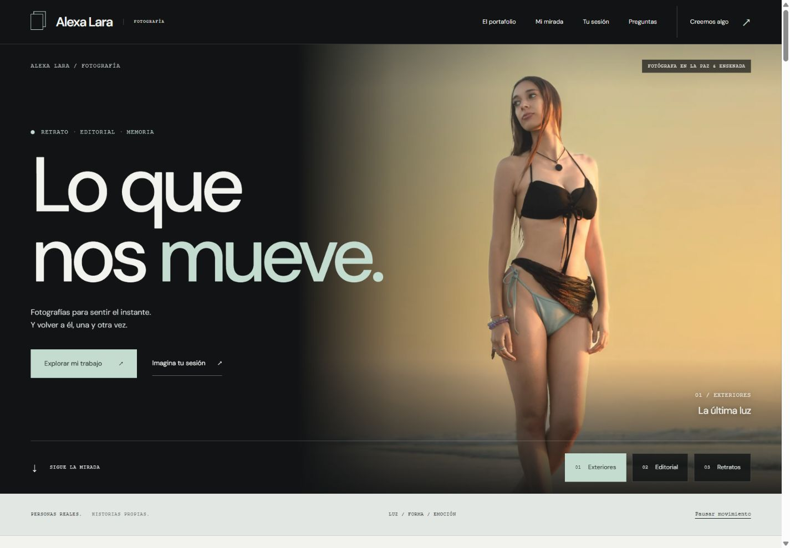

# Alexa Lara — Fotografía

Portafolio editorial para Alexa Lara, fotógrafa en La Paz y Ensenada. HTML, CSS y JavaScript, sin framework, compilación ni servicios de pago. Preparado para seguir iterando con el cliente y subir a hosting estático.

Repositorio: [Ozzy-Barbosa/alexa-lara](https://github.com/Ozzy-Barbosa/alexa-lara).

Dirección configurada para GitHub Pages: [Alexa Lara Fotografía](https://ozzy-barbosa.github.io/alexa-lara/).



## Esta versión

La iteración **V5 está publicada y comprobada en GitHub Pages**. Renueva la identidad visual y conserva las funciones de consulta de V4. El despliegue del código `44fde4d`, la comparación de los archivos públicos y la revisión visual de escritorio y móvil están registrados en `docs/PUBLICACION.md`; las pruebas locales y sus límites, en `docs/VERIFICACION.md`.

- Identidad de estudio fotográfico contemporáneo: negro carbón, blanco frío, grises plata y salvia clara; titulares grandes y compactos en DM Sans.
- Portada fotográfica inmersiva con tres escenas manuales: Exteriores, Editorial y Retratos. Selector con teclado y estado activo, sin reproducción automática.
- Galería oscura sin marcos decorativos, presentación de Alexa en díptico ortogonal y sesiones como tríptico fotográfico. Composición adaptable a móvil.
- **22 fotografías distintas** obtenidas del perfil [@aleroblesfotografia](https://www.instagram.com/aleroblesfotografia/) y sus colaboraciones visibles. Sin fotos de banco.
- Galería con Retratos, Editorial, Familia y Exteriores; muestra 12 imágenes y permite cargar el resto.
- Visor con anterior/siguiente, teclado, Escape, gestos táctiles y enlace a cada publicación original.
- Microanimaciones finitas y progreso de lectura. Se retiraron parallax, inclinaciones y cinta continua; los dos controles de pausa están sincronizados y respetan la preferencia de movimiento reducido del sistema.
- Seis preguntas frecuentes desplegables, disponibles también sin JavaScript.
- Formulario en dos pasos: sesión, lugar, fecha e idea; después, nombre y consentimiento. Incluye revisión, corrección del mensaje, copia y contacto por Instagram; listo para WhatsApp al configurar el número real.
- Dos retratos confirmados de Alexa en el díptico: el profesional y el personal guardado en `assets/alexa/`. No aumentan el número de obras de la galería.
- Aviso inicial de privacidad en `privacidad.html`, enlazado desde el formulario y el footer.
- Imágenes locales WebP, tamaños adaptativos, carga diferida y dimensiones reservadas.
- **6 posiciones adicionales reservadas** para nuevas fotografías, ocultas hasta completarlas.

## Abrir y comprobar

Requiere Node.js para el servidor de desarrollo; el sitio publicado no lo necesita.

```sh
npm run dev
# http://127.0.0.1:8000
npm run check
```

No requiere `npm install`. El servidor de desarrollo escucha únicamente en el equipo local. `npm run check` incluye comprobaciones estáticas y diez pruebas de interacciones. Estas últimas usan un entorno simulado de Node.js: comprueban lógica y estados, pero no sustituyen las pruebas de navegador, teclado, renderizado o preferencia real de movimiento del sistema.

## Continuar con el cliente

| Archivo | Qué se cambia |
| --- | --- |
| `data.js` | WhatsApp, fotos, orden, categorías, títulos y posiciones pendientes |
| `index.html` | Textos, imágenes destacadas de portada, biografía, sesiones y contacto |
| `styles.css` | Colores, tipografía, composición, responsive y movimiento |
| `script.js` | Galería, visor, menú y preparación de consultas |
| `privacidad.html` | Aviso inicial, funcionamiento del formulario y datos del responsable pendientes |
| `docs/PROMPT-DISENO-ALEXA.md` | Prompt reutilizable aplicado a este rediseño |
| `docs/PROMPT-ESTILO-EDITORIAL-V3.md` | Dirección visual histórica de V3, sustituida por V5 |
| `docs/PROMPT-INTERACCIONES-V4.md` | Formulario de dos pasos, FAQ, privacidad, identidad y comprobaciones |
| `docs/PROMPT-IDENTIDAD-FOTOGRAFICA-V5.md` | Dirección visual actual y criterios para mantener una identidad propia |
| `docs/ASSETS-INSTAGRAM.md` | Procedencia de cada foto y preparación de versiones web |
| `docs/VERIFICACION.md` | Comprobaciones y límites de esta entrega |

### Fotografías nuevas

1. Guardar las exportaciones optimizadas en `assets/portfolio/`. No hace falta sobrescribir originales.
2. Sustituir las rutas de una entrada de `photos` en `data.js`, o completar una entrada de `futureSlots` y moverla a `photos`.
3. Completar `title`, `alt`, `category`, `src`, `full`, `width`, `height`, `srcWidth` y `fullWidth`; poner `published: true` para mostrarla. `position` controla el punto focal.
4. Actualizar también las imágenes destacadas que se quieran cambiar en `index.html`.
5. Ejecutar `npm run check` y comprobar encuadres en móvil y en el visor.

Las categorías disponibles son `retratos`, `editorial`, `familia` y `exteriores`. Los títulos de la galería son rótulos curatoriales editables, no nombres oficiales de proyectos. La guía de medios contiene el script opcional con Pillow para generar WebP sin recortar.

### Contacto

Editar `whatsapp` en `data.js` con el código de país y el número oficial, solo dígitos, formato internacional de 10 a 15 dígitos. Con ese dato, después de preparar la consulta aparece el enlace “Continuar en WhatsApp”.

Mientras esté vacío, el formulario prepara el mensaje para copiarlo y escribir al Instagram confirmado de Alexa. **No envía ni almacena solicitudes, no reserva fechas y no funciona como CRM.** El visitante elige cuándo enviarlo. No se inventó un teléfono.

El paso 1 recoge servicio, lugar, fecha opcional y mensaje opcional; el paso 2 pide nombre y consentimiento. «Editar mi idea» conserva los datos y retira la consulta preparada anterior para que se revise de nuevo. Instagram se abre sin adjuntar el mensaje: el visitante debe pegarlo y enviarlo.

### Aviso de privacidad

El usuario confirmó a Alexa Lara como fotógrafa independiente. `privacidad.html` es un **aviso inicial, no el aviso integral terminado**: siguen pendientes el correo de privacidad, el domicilio para notificaciones y el procedimiento formal de atención. Completar esos datos con Alexa antes de presentarlo como definitivo.

El aviso describe la preparación local, el portapapeles, el contacto externo, GitHub Pages y Google Fonts. No hay WhatsApp activo, CRM, analítica ni base de datos de solicitudes en esta versión. Si se incorpora cualquiera de esas funciones o cambia el alojamiento, revisar el aviso para que siga describiendo el funcionamiento real.

## Subir a hosting

1. Confirmar con Alexa la selección, textos, servicios, número y dominio.
2. Configurar el dominio (admite también una subcarpeta):

```sh
npm run configure -- https://tu-dominio.com
```

El comando escribe canonical, URL e imagen Open Graph absolutas, sitemap, robots, enlaces de la página 404 y canonical del aviso de privacidad. Actualmente está configurada la dirección real de GitHub Pages; vuelve a ejecutar el comando cuando se confirme el dominio propio.

3. Subir `index.html`, `privacidad.html`, `styles.css`, `script.js`, `data.js`, `404.html`, `robots.txt`, `sitemap.xml`, `site.webmanifest` y `assets/` a la carpeta pública. Incluir `assets/alexa/` junto con las fotografías del portafolio. `docs/`, `scripts/`, `package.json` y `.git/` no son necesarios en el hosting.
4. Configurar HTTPS y la página 404 en el proveedor. Verificar el dominio en Search Console y enviar el sitemap.

### GitHub Pages

Fuente de publicación: rama `main`, carpeta raíz `/`. El archivo `.nojekyll` permite servir el sitio estático sin procesarlo con Jekyll. Una vez activado Pages, los cambios enviados a `main` generan la siguiente publicación.

La dirección de esta entrega es `https://ozzy-barbosa.github.io/alexa-lara/`. Canonical, Open Graph, sitemap y enlaces 404 están configurados para esa subcarpeta. El estado de publicación se comprueba en los despliegues del repositorio; guardar un commit por sí solo no confirma que ya esté disponible en línea.

Cuando se contrate un dominio propio, volver a ejecutar `npm run configure -- https://tu-dominio.com`, revisar DNS/HTTPS y publicar esos cambios. El número de WhatsApp y la selección definitiva de fotografías siguen sujetos a confirmación de Alexa.

## Evidencia visual

La portada V5 corresponde a la implementación local. Las capturas V3 se conservan como historial visual, no como representación del diseño actual. Las comprobaciones realizadas y las pendientes figuran en `docs/VERIFICACION.md`.

- [Portada de escritorio V5](docs/previews/v5-portada-desktop.png)
- [Portada móvil V3](docs/previews/v3-portada-movil.png)
- [Galería V3](docs/previews/v3-galeria-desktop.png)
- [Contacto V3](docs/previews/v3-contacto-desktop.png)
- [Perfil de Instagram verificado](docs/previews/instagram-perfil.png)

El SEO incluye contenido local, metadatos y datos estructurados con información conocida. El posicionamiento también depende de contenido original, reputación y presencia local; no se garantiza una posición concreta.

Las fotografías se incluyen como material provisional del proyecto de la clienta. No se concede una licencia de reutilización de su obra.
