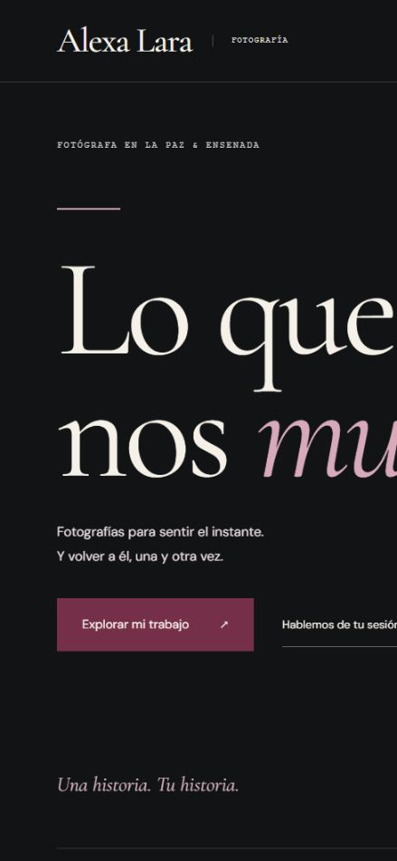

# Alexa Lara — Fotografía

Portafolio editorial para Alexa Lara, fotógrafa en La Paz y Ensenada. HTML, CSS y JavaScript, sin framework, compilación ni servicios de pago. Preparado para seguir iterando con el cliente y subir a hosting estático.

Repositorio: [Ozzy-Barbosa/alexa-lara](https://github.com/Ozzy-Barbosa/alexa-lara).

Dirección configurada para GitHub Pages: [Alexa Lara Fotografía](https://ozzy-barbosa.github.io/alexa-lara/).



## Esta versión

La iteración **V6 está publicada y comprobada en GitHub Pages**. Incorpora fotografías entregadas por la clienta, una identidad más formal, contacto confirmado y tarjeta digital. El despliegue, la comparación de 84 archivos públicos y la revisión de escritorio y móvil están registrados en `docs/PUBLICACION.md`; las pruebas y sus límites, en `docs/VERIFICACION.md`.

**Ajuste solicitado al cierre, publicado y comprobado:** se conserva el inicio fotográfico integrado en negro con desvanecido, siguiendo la referencia del cliente, y se reserva el vino para los acentos del inicio. La revisión final corresponde a `1783e9f`, con estilos versionados para evitar que el navegador mezcle la página nueva con CSS antiguo.

- Identidad formal en negro y marfil con acentos vino: titulares Cormorant Garamond y lectura en DM Sans. La portada integra una sola fotografía protagonista en un fondo negro con desvanecido, sin dividir el inicio en una mitad vino y otra fotográfica.
- Galería oscura, presentación de Alexa con retratos confirmados y sesiones con imágenes pertinentes. Composición adaptable a móvil.
- **32 composiciones únicas: 11 fotografías entregadas por la clienta y 21 provisionales de Instagram**, sin fotos de banco ni duplicados publicados de la misma composición.
- Galería con Retratos, Editorial, Familia, Exteriores y **Producto, con cuatro imágenes**; muestra 12 fotografías y permite cargar el resto.
- Visor con anterior/siguiente, teclado, Escape y gestos táctiles. El enlace a la publicación original aparece solo cuando existe una fuente de Instagram; no se inventa para las fotografías entregadas.
- Microanimaciones finitas y progreso de lectura. Se retiraron parallax, inclinaciones y cinta continua; los dos controles de pausa están sincronizados y respetan la preferencia de movimiento reducido del sistema.
- Seis preguntas frecuentes en acordeón exclusivo, con transición de 300 ms y cambios inmediatos al reducir o pausar el movimiento. Conserva su alternativa sin JavaScript.
- Formulario en dos pasos: sesión, lugar, fecha e idea; después, nombre y consentimiento. Incluye revisión, corrección del mensaje, copia y apertura de WhatsApp con el número confirmado; también permite contactar por Instagram.
- Dos retratos confirmados de Alexa en el díptico: el profesional y el personal guardado en `assets/alexa/`. No aumentan el número de obras de la galería.
- Aviso inicial de privacidad en `privacidad.html`, enlazado desde el formulario y el footer.
- Tarjeta digital en `tarjeta.html`, QR estático verificado, tarjeta PNG descargable, contacto VCF y vista previa social de 1200 × 630 px.
- Imágenes locales WebP, tamaños adaptativos, carga diferida y dimensiones reservadas.
- **6 posiciones adicionales reservadas** para nuevas fotografías, ocultas hasta completarlas.

## Abrir y comprobar

Requiere Node.js para el servidor de desarrollo; el sitio publicado no lo necesita.

```sh
npm run dev
# http://127.0.0.1:8000
npm run check
```

No requiere `npm install`. El servidor de desarrollo escucha únicamente en el equipo local. `npm run check` incluye comprobaciones estáticas y **13 pruebas de interacciones**, superadas en esta iteración. Estas últimas usan un entorno simulado de Node.js: comprueban lógica y estados, pero no sustituyen las pruebas de navegador, teclado, renderizado o preferencia real de movimiento del sistema.

## Continuar con el cliente

| Archivo | Qué se cambia |
| --- | --- |
| `data.js` | WhatsApp, fotos, orden, categorías, títulos y posiciones pendientes |
| `index.html` | Textos, imágenes destacadas de portada, biografía, sesiones y contacto |
| `styles.css` | Colores, tipografía, composición, responsive y movimiento |
| `script.js` | Galería, visor, menú y preparación de consultas |
| `privacidad.html` | Aviso inicial, funcionamiento del formulario y datos del responsable pendientes |
| `tarjeta.html`, `assets/card/` | Tarjeta digital, contacto descargable, QR y vista previa social |
| `docs/PROMPT-DISENO-ALEXA.md` | Prompt reutilizable aplicado a este rediseño |
| `docs/PROMPT-ESTILO-EDITORIAL-V3.md` | Dirección visual histórica de V3 |
| `docs/PROMPT-INTERACCIONES-V4.md` | Formulario de dos pasos, FAQ, privacidad, identidad y comprobaciones |
| `docs/PROMPT-IDENTIDAD-FOTOGRAFICA-V5.md` | Dirección visual histórica de V5 |
| `docs/PROMPT-IDENTIDAD-V6.md` | Dirección visual actual, fotografía real y criterios de continuidad |
| `docs/ASSETS-INSTAGRAM.md` | Procedencia de cada foto y preparación de versiones web |
| `docs/ASSETS-CLIENTE.md` | Selección entregada, importador incremental y control de duplicados |
| `docs/TARJETA-DIGITAL.md` | Generación de tarjeta, QR, contacto, vista previa y pruebas de lectura |
| `docs/VERIFICACION.md` | Comprobaciones y límites de esta entrega |

### Fotografías nuevas

1. Importar la carpeta recibida con `python scripts/import-client-images.py "ruta/a/originales"`. Requiere Pillow; conserva los originales y genera variantes WebP en `assets/portfolio/`.
2. Revisar `assets/portfolio/contact-sheet.jpg`, el inventario y `curation.json`. El importador detecta duplicados exactos; las copias recomprimidas o recortadas se comparan visualmente.
3. Incorporar la selección en `photos` de `data.js`, sustituyendo una entrada anterior cuando sea la misma composición. El importador **no publica automáticamente ni modifica el catálogo**.
4. Completar `title`, `alt`, `category`, `src`, `full`, `width`, `height`, `srcWidth`, `fullWidth` y `published: true`. Para fotos entregadas: `provenance: "client"`, `provisional: false` y `source: ""`. `position` controla el punto focal.
5. Actualizar las imágenes destacadas de `index.html` que corresponda, ejecutar `npm run check` y comprobar móvil y visor.

Las categorías disponibles son `retratos`, `editorial`, `familia`, `exteriores` y `producto`. Los títulos son rótulos curatoriales editables, no nombres oficiales de proyectos. El importador trabaja de forma incremental y conserva las imágenes anteriores; la guía `docs/ASSETS-CLIENTE.md` explica el flujo completo y la gestión de color y metadatos.

### Contacto

Contactos confirmados por el usuario:

- Teléfono: **+52 612 104 4559**; enlace `tel:+526121044559` y el mismo número en VCF.
- WhatsApp configurado: `https://wa.me/5216121044559`; `data.js` guarda `5216121044559`, específico para el enlace de WhatsApp.
- Correo: **alexalarar17@gmail.com**.
- Instagram profesional: **@aleroblesfotografia**.

El formulario prepara el mensaje localmente. «Continuar en WhatsApp» abre la plataforma con ese texto para revisarlo; la persona decide enviarlo a Alexa. También puede copiarlo para Instagram. **El sitio no almacena solicitudes, no reserva fechas y no funciona como CRM.** No se enviaron mensajes reales para comprobar la implementación.

El paso 1 recoge servicio, lugar, fecha opcional y mensaje opcional; el paso 2 pide nombre y consentimiento. «Editar mi idea» conserva los datos y retira la consulta preparada anterior para que se revise de nuevo. Instagram se abre sin adjuntar el mensaje: el visitante debe pegarlo y enviarlo.

### Tarjeta digital

`tarjeta.html` reúne enlaces directos y descargas. `assets/card/alexa-lara-tarjeta.png` es la tarjeta de 1080 × 1350 px; el QR PNG/SVG apunta a la URL pública de la tarjeta y `alexa-lara.vcf` permite guardar el contacto. El footer ofrece esos accesos.

El QR y la tarjeta PNG se decodificaron con un lector independiente. La evidencia y los hashes están en `assets/card/manifest.json`. La vista previa `assets/card/alexa-lara-social.jpg` mide 1200 × 630 px y usa una fotografía real de Alexa con su cámara. Las plataformas externas pueden conservar una vista previa anterior en caché.

Para regenerar los recursos: `python scripts/build-brand-assets.py`; requiere Pillow y ReportLab. `--verify` añade comprobación independiente con ZXing-C++ disponible. Consulta `docs/TARJETA-DIGITAL.md` antes de cambiar el dominio o los datos; las tarjetas ya descargadas conservan el contenido que tenían al generarse.

### Aviso de privacidad

El usuario confirmó a Alexa Lara como fotógrafa independiente y proporcionó el correo de contacto incluido en el aviso. `privacidad.html` es un **aviso inicial, no el aviso integral terminado**: siguen pendientes el domicilio para notificaciones y el procedimiento formal de atención. Completar esos datos con Alexa antes de presentarlo como definitivo.

El aviso describe la preparación local, el portapapeles, los enlaces de WhatsApp, correo y teléfono, el alojamiento y las tipografías externas de la página principal. La tarjeta utiliza fuentes locales. No hay CRM, analítica ni base de datos de solicitudes en esta versión. Si cambia el tratamiento de datos o el alojamiento, revisar el aviso para que siga describiendo el funcionamiento real.

## Subir a hosting

1. Confirmar con Alexa la selección y los textos finales, completar los datos de privacidad pendientes y definir el dominio.
2. Configurar el dominio (admite también una subcarpeta):

```sh
npm run configure -- https://tu-dominio.com
```

El comando actualiza canonical, Open Graph y Twitter Card de inicio y tarjeta, privacidad, sitemap, robots, página 404 y enlace visible del QR. Si cambia la base pública o faltan recursos, regenera QR, tarjeta y VCF antes de guardar el HTML; esa operación requiere Python con Pillow y ReportLab. Usa `--python ruta/al/python` o la variable `PYTHON` si el ejecutable no se llama `python`; `--dry-run` permite revisar el plan sin modificar archivos. Actualmente está configurada la dirección real de GitHub Pages.

3. Subir `index.html`, `tarjeta.html`, `privacidad.html`, `styles.css`, `script.js`, `data.js`, `404.html`, `robots.txt`, `sitemap.xml`, `site.webmanifest` y `assets/` a la carpeta pública. Incluir `assets/alexa/`, `assets/card/` y `assets/portfolio/` junto con las fotografías provisionales. `docs/`, `scripts/`, `package.json` y `.git/` no son necesarios en el hosting.
4. Configurar HTTPS y la página 404 en el proveedor. Verificar el dominio en Search Console y enviar el sitemap.

### GitHub Pages

Fuente de publicación: rama `main`, carpeta raíz `/`. El archivo `.nojekyll` permite servir el sitio estático sin procesarlo con Jekyll. Una vez activado Pages, los cambios enviados a `main` generan la siguiente publicación.

La dirección de esta entrega es `https://ozzy-barbosa.github.io/alexa-lara/`. Canonical, Open Graph, sitemap y enlaces 404 están configurados para esa subcarpeta. El estado de publicación se comprueba en los despliegues del repositorio; guardar un commit por sí solo no confirma que ya esté disponible en línea.

Cuando se contrate un dominio propio, volver a ejecutar `npm run configure -- https://tu-dominio.com`, revisar los nuevos QR, DNS/HTTPS y publicar esos cambios. El teléfono y correo ya están confirmados; la selección definitiva de fotografías y los datos restantes del aviso se revisan con Alexa.

## Evidencia visual

Las capturas V6 corresponden a la implementación local. Las imágenes de iteraciones anteriores se conservan como historial visual, no como representación del diseño actual. Las comprobaciones realizadas y las pendientes figuran en `docs/VERIFICACION.md`.

- [Portada de escritorio V6](docs/previews/v6-portada-escritorio.png)
- [Portada móvil V6](docs/previews/v6-portada-movil.png)
- [Perfil de Instagram verificado](docs/previews/instagram-perfil.png)

El SEO incluye contenido local, metadatos y datos estructurados con información conocida. El posicionamiento también depende de contenido original, reputación y presencia local; no se garantiza una posición concreta.

Las fotografías pertenecen al proyecto de la clienta; las procedentes de Instagram siguen identificadas como provisionales y las entregadas tienen su propia trazabilidad. No se concede una licencia de reutilización de su obra.
